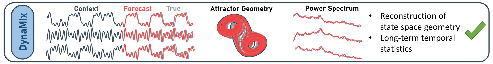
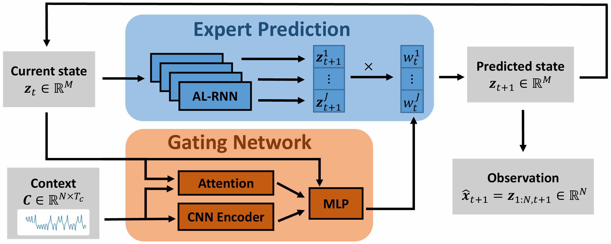

# **DynaMix: True Zero-Shot Inference of Dynamical Systems Preserving Long-Term Statistics (NeurIPS 2025)**

This repository provides a Julia implementation of DynaMix, a foundation model architecture for zero-shot inference of dynamical systems that preserves long-term statistics.
Note there is also a Python version available at [https://github.com/DurstewitzLab/DynaMix-python](https://github.com/DurstewitzLab/DynaMix-python).

## Theoretical Background

Dynamical systems are ubiquitous in nature and society, from weather patterns and climate to financial markets and biological systems. While traditional forecasting methods require extensive training data for each specific system, DynaMix takes a fundamentally different approach by learning universal dynamical representations that generalize across systems.

### Foundation Model for Dynamical Systems

DynaMix serves as a foundation model for dynamical systems. By training on a diverse collection of dynamical systems, DynaMix learns to extract and represent the underlying patterns and principles that govern temporal evolution across different domains. Unlike traditional methods that require retraining for each new system, DynaMix achieves zero-shot inference of a new system by only providing a short context window of observations.

### Key Innovations
- **Accurate Zero-Shot DSR**: DynaMix generalizes across diverse dynamical systems without fine-tuning, accurately capturing attractor geometry and long-term statistics.
- **Multivariate Dynamics Modeling**: The multivariate architecture captures dependencies across system dimensions and adapts flexibly to different dimensionalities and context lengths via embeddings.
- **Efficient and Lightweight**: Delivers high performance with a compact design, enabling orders-of-magnitude faster inference than traditional foundation models.
- **Interpretable Dynamics Composition**: Provides insights into the dynamical composition of reconstructed systems, revealing similarities across different dynamical systems.
- **General Time Series Forecasting**: Extends beyond DSR to general time series forecasting using adaptable embedding techniques.



## DynaMix Demo
Try DynaMix instantly through our interactive Huggingface Space at [https://huggingface.co/spaces/DurstewitzLab/DynaMix](https://huggingface.co/spaces/DurstewitzLab/DynaMix). This demo lets you test the model's capabilities without installing any code or dependencies. Simply upload your time series data in the required format and generate long-term forecasts with zero-shot inference.

## Code Setup and Usage
The entire project is written in [Julia](https://julialang.org/) using the [Flux](https://fluxml.ai/Flux.jl/stable/) deep learning stack.

Install the package in a new Julia environment:
```bash
julia> ]
(@v1.10) pkg> activate .
(DSR) pkg> instantiate
```
We recommend using the latest version of [Julia (>v1.10)](https://julialang.org/downloads/).
Note that for plotting tha PyPlot package is used, requiring a python installation.

## DynaMix Model Architecture

DynaMix is based on a sparse mixture of experts (MoE) architecture operating in latent space:

1. **Expert Networks**: Each expert is a specialized dynamical model (AL-RNN), given through

$$ z_{t+1}^j= A^jz_t^j + W^j \Phi^*(z_t^j) +h^j $$

2. **Gating Network**: Selects experts based on the provided context and current latent representation of the dynamics

By aggregating the expert weighting $w_{j,t}^{exp}$ with the expert prediction $z_t^i$ the next state is predicted

$$z_{t+1} = \sum_{j=1}^J w_{j,t}^{exp} z_t^i$$



Model implementations:
- DynaMix &rarr; [`DynaMix`](src/model/DynaMix.jl), individual specifications for the architecture can be modified in the [`settings`](settings/defaults.json) file.
- "Identity" mapping &rarr; [`Identity`](src/model/identity.jl), for generating observations from the latent states


## Evaluating DynaMix

### Zero-Shot Forecasting

DynaMix enables true zero-shot forecasting - the ability to generate accurate predictions for previously unseen dynamical systems without retraining or fine-tuning:

1. A short context window from the new system is provided
2. DynaMix infers the underlying dynamics from this context
3. The model generates long-term forecasts that preserve both trajectory accuracy and statistical properties

### Pretrained Model
A lightweight pretrained DynaMix model can be found in the [models](models/) folder. This model has been trained on a diverse collection of dynamical systems and serves as a foundation model for zero-shot forecasting tasks.

To use the pretrained model load it via 
```Julia
model, O = load_model("models/dynamix-3d-alrnn-v1.0.bson")
```
The pretrained model includes both the DynaMix architecture and the observation model, allowing for immediate deployment on new dynamical systems.


### Evaluation Pipeline

Example forecasting evaluations of dynamical systems and time series can be found in the [notebooks](notebooks/) folder. 

Given context data from the target system with shape $(T_C) \times (N)$ (where $T_C$ is the context length and $N$ is the data dimensionality), generate forecasts by passing the data through the `DynaMix_forecasting_pipeline` along with the loaded model and observation model:
```Julia
context = ...
DynaMix_forecasting_pipeline(model, O, context, T)
```

The forecasting pipeline requires the following inputs:

- *model*: DynaMix foundation model. Model and observation model can be loaded using the `load_model("path/to/model.bson")` function.
- *O*: Observation model. Model and observation model can be loaded using the `load_model("path/to/model.bson")` function.
- *context*: Context data in the form of a $(T_C) \times (N)$ matrix
- *T*: Forecast horizon, i.e. an integer specifying how many future steps to forecast

Optional arguments:
- *preprocessing_method*: for time series forecasting, choose between `pos_embedding`, `delay_embedding`, `delay_embedding_PECUZAL` and `zero_embedding` as preprocessing method (default: `pos_embedding`)
- *standardize*: standardize data? `True`/`False` (default: `True`)
- *initial_x*: Optional initial condition for the model in vector format, else last context value is used (default: `nothing`)


## Training the Model

### Training Algorithm

DynaMix is trained using backpropagation through time with sparse teacher forcing (STF), a technique that balances stability and learning:

1. The model makes predictions over a sequence of time steps
2. At regular intervals (specified by `teacher_forcing_interval`), the model's state is reset to match ground truth
3. This prevents error accumulation while still allowing the model to learn long-term dependencies

### Training the Model
To start training, execute the `main.jl` file and see [`parsing`](src/parsing.jl) for more details. Appropriate arguments can be parsed via the command line (or via changing the ones from the defaults in the [`settings`](settings/defaults.json)):
```
$ julia -t4 --project main.jl --model DynaMix --experts 10 --latent_dim 30 -P 2 --epochs 2000
```

### Model Saving
During training the model is saved every `scalar_saving_interval` epochs along with metrics evaluated on the test data. The saved model can be found in a generated `Results` folder and loaded using the `load_model("path/to/model.bson")` function.


## Versions
- >Julia 1.10.1
- >Flux 0.14.16

## Citation

If you use DynaMix in your research, please cite our paper:

```
@misc{hemmer2025truezeroshotinferencedynamical,
      title={True Zero-Shot Inference of Dynamical Systems Preserving Long-Term Statistics}, 
      author={Christoph Jürgen Hemmer and Daniel Durstewitz},
      year={2025},
      eprint={2505.13192},
      archivePrefix={arXiv},
      primaryClass={cs.LG},
      url={https://arxiv.org/abs/2505.13192}, 
}
```
